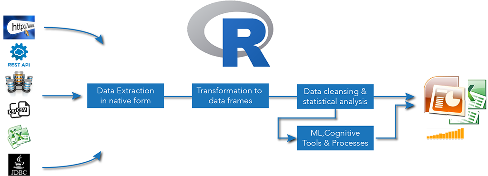

# Information Factory - An MS PowerPoint Machine
The code automates the creation of power point slide decks
&nbsp;

## What is the puprose of the factory?
Over time creating analytics and statistics, we are regularly asked to provide output from on-line dashboard and reporting systems to PowerPoint slides. This is a manual, tedious and error prone process not requiring much brainpower.

The code connects to various data sources, extracts data and injects graps and charts on slides automatically. This expedites the process and reducing the need to place data on charts manually. Effort can now be focused on analysing the information and providing relevant business comments in a much faster way.

&nbsp;

## What do you need to know to consume this code?
R, R, R and R.
&nbsp;

## What is required to run the factory?
You need to install and configure R and RStudio on your machine and ensure Java has been installed accordingly. Each workstation configuration is different so expect to spend some time on this before you can load all the libraries in the 01_LoadLibraries.R file.
&nbsp;

The key module you will be needing is [ReporteRs](http://davidgohel.github.io/ReporteRs/index.html).

## How does it work?

&nbsp;

## Who Pieced This Together?
Bjoern W. Steffens - bjoern.steffens1@gmail.com
&nbsp;
